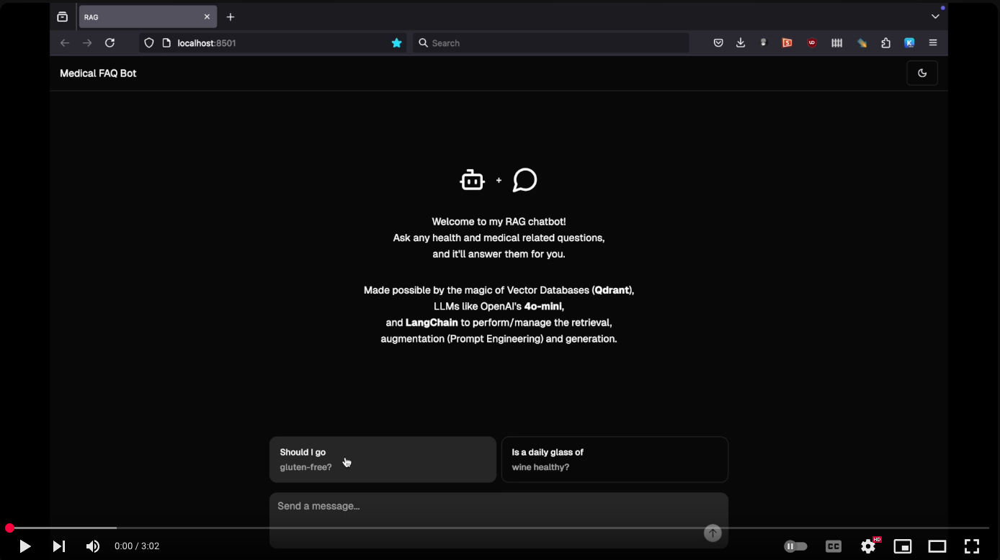
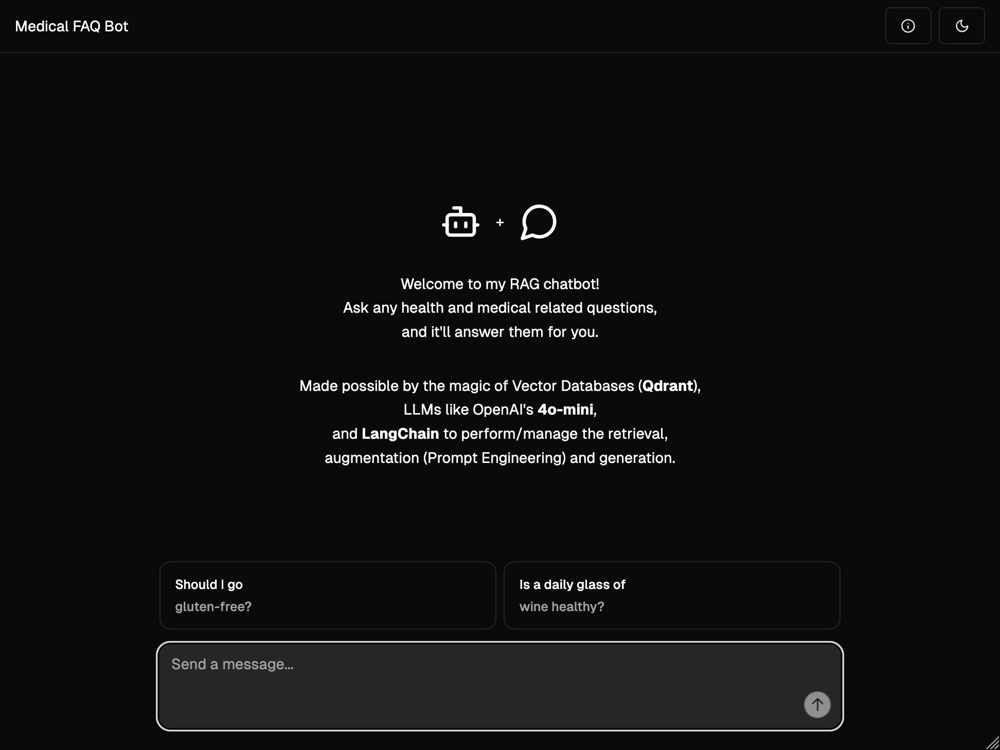
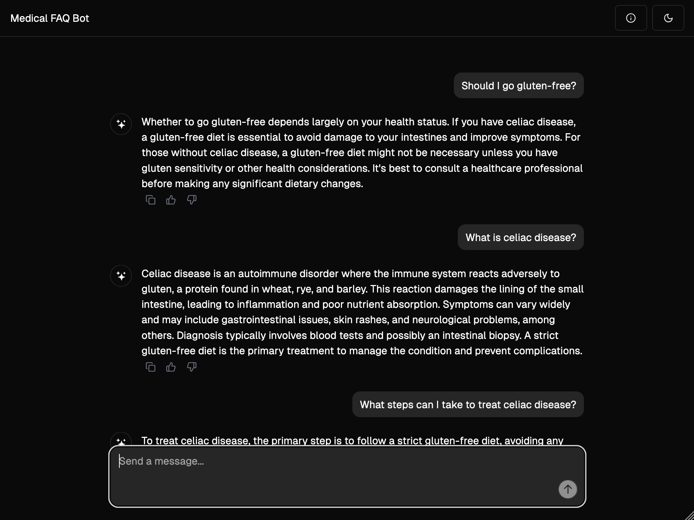
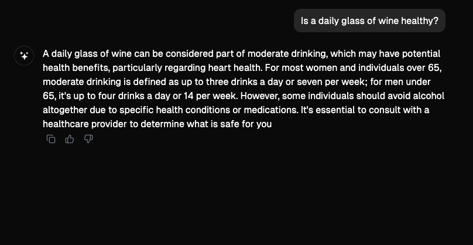
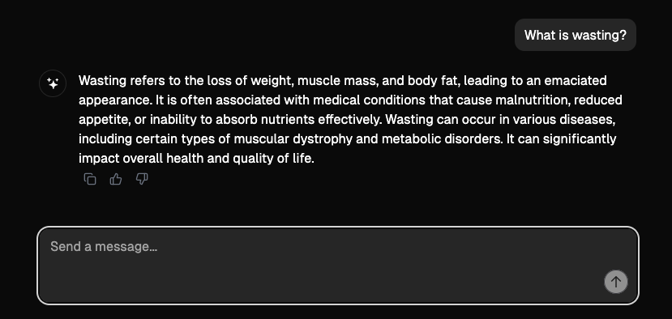
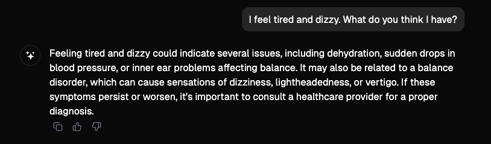
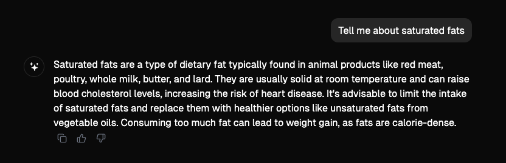

# Overview
Medical FAQ chatbot using Retrieval Augmented Generation to provide accurate answers.

## Key Features:
- Retrieval-Augmented Generation (RAG): Combines vector-based retrieval with LLMs to generate accurate, context-aware medical responses.
- Optimized Vector Search with Qdrant: Enables fast and accurate semantic search across the MedQuAD dataset.
- FastAPI-Powered Backend: High-performance API ensuring low-latency response times.
- LangChain-Integrated Query Processing: Enhances contextual understanding and document retrieval.
- React Frontend: Delivers a responsive, modern UI for seamless user interaction.
- OpenAI API Integration: Leverages advanced language models to improve the quality and relevance of generated answers.

## Demo

<!--  -->

More images and videos in the `docs` folder of this repository!

## Motivations
I wrote a few notebooks on RAG recently on Kaggle, and used different datasets, including Pokemon, MedQuad, and a Baked Foods dataset to store their documents as vectors, and generate high quality answers based on the retrieved context.

I decided to turn one of the notebooks into a standalone end-to-end project using FastAPI, Qdrant, Langchain, OpenAI API and React.

## Tech
Built the front-end in React, using a modified chatbot-ui template, and the back-end using FastAPI web framework.

### Backend
- Python
- FastAPI
- Langchain
- Qdrant
- OpenAI API

### Frontend
- React
- Radix-UI
- Vite

## Prompt Engineering
> You are an assistant for question-answering tasks. Use the following pieces of retrieved context to answer the question. 
>
> If you don't know the answer, just say that you don't know. Keep the answer short and concise. Try to use less than 5 sentences.

## More demo images
#### Landing Page

#### Gluten and Celiac Disease

#### Is a daily glass of Wine Healthy?

#### What's wasting

#### I feel tired and dizzy...

#### Saturated fats?

#### Microsoft Office?

## Build
### Backend
1. Change directory to `backend`.
2. Run `poetry install --no-ansi --without dev`.
3. Run `poetry shell`.
4. Start FastAPI server `python3 main.py`.

### Frontend
1. Change directory to `ragbot`.
2. Run `pnpm install`.
3. Start frontend app `pnpm run dev`.
